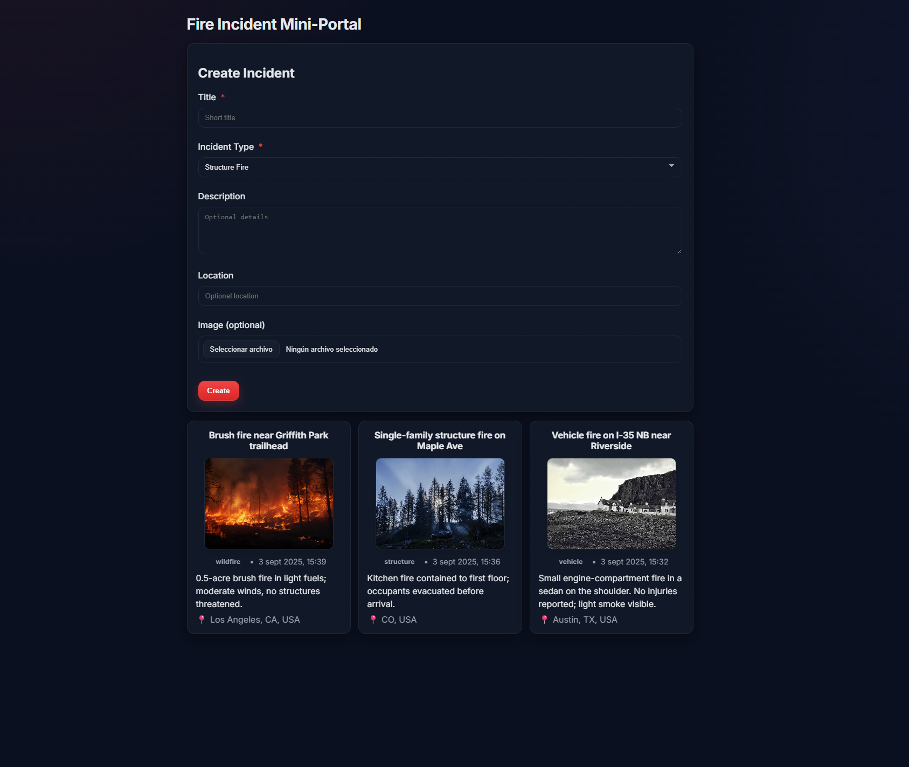

# Fire Incident Mini-Portal

Tiny full-stack app (React + Express) to create and list fire incidents. Focus: end-to-end thinking, simple UX, runtime persistence + optional JSON persistence.

## 🏁 Quick Start

### Option A — With Docker (recommended)
```bash
docker compose up --build
```
- Web: http://localhost:3000
- API: http://localhost:4000

### Option B — Local (two terminals)

**API**
```bash
cd server
# On Windows PowerShell:
$env:CORS_ORIGIN="http://localhost:3000"
npm install
npm run dev # -> http://localhost:4000
```

**Web**
```bash
cd web
npm install
npm start # -> http://localhost:3000
```

**Dev UX:** hot reload is enabled (CRA with polling; nodemon with legacy watch).

## 🧰 Tech Stack

- **Frontend:** React (Create React App), vanilla CSS (modern, responsive, dark aware)
- **Backend:** Node.js + Express, multer (file uploads), nanoid (IDs), morgan (logs), cors
- **Persistence:** In-memory store (required) + JSON file on disk (bonus)
- **Static files:** /uploads served by Express
- **Containerization:** Docker + docker-compose for local dev

## 🧭 Tiny Architecture Sketch

A single-page React client posts incidents (multipart form) to an Express API. The API stores incidents in memory for runtime persistence and also writes them to `data/incidents.json` (bonus) so they survive restarts. Optional images are saved to `/uploads` and served statically; the UI shows thumbnails.

```
[React SPA] --fetch--> [Express API]
             \-- (static)
                  ├── MemStore (runtime)
                  └── JSON file (bonus) -> server/data/incidents.json
```

## ✅ What's Implemented

- **Create an incident** with:
  - title (required)
  - incident_type (required select: `structure`|`vehicle`|`wildfire`)
  - description (optional)
  - location (optional)
  - image (optional)
- **Basic validation** on both client & server
- **List incidents** (reverse chronological) with title, type, created time, thumbnail
- **Runtime persistence** (in-memory) — survives browser refresh during the same run
- **Bonus:** read/write `data/incidents.json` so incidents survive API restarts
- **File management niceties:** Unique filenames, type filter (jpg|png|webp), 4MB size cap
- **Dev experience:** Hot reload in front (CRA polling) & back (nodemon legacy watch)
- **Docker setup** with volumes for uploads and data

## ⚖️ Trade-offs & Assumptions

- **No database** (by design): JSON file is sufficient for scope/timebox
- **No auth** (not required); API is open on localhost
- **Happy-path validation:** simple checks; no schema lib (kept code lean)
- **No pagination/search** (list is small for the exercise)
- **Images served statically** instead of embedding as data URLs → better caching, smaller API payloads, simpler UX

### Docker Volumes

By default, uploads and data are named volumes. Files exist inside containers even if you don't see them on your host tree.

**To inspect:**
```bash
docker compose exec api sh -lc "ls -lah /app/data && ls -lah /app/uploads"
docker compose exec api sh -lc "head -n 20 /app/data/incidents.json"
```

If you prefer to see them on host, switch to bind mounts in `docker-compose.yml`:
```yaml
- ./server/uploads:/app/uploads
- ./server/data:/app/data
```

## ▶️ Using the App

1. Open http://localhost:3000
2. Fill **Title** and **Incident Type** (required); optionally add **Description**, **Location**, and an **Image**
3. **Submit** — the form clears, list refreshes instantly, and a thumbnail appears if an image was uploaded

## 🔌 API

**Base URL (dev):** http://localhost:4000

### `POST /api/incidents` — Create (multipart/form-data)

**Fields:**
- `title` (string, required)
- `incident_type` (string, required: `structure`|`vehicle`|`wildfire`)
- `description?` (string)
- `location?` (string)
- `image?` (file: jpg/png/webp, ≤ 4MB)

**Response 201:**
```json
{
  "id": "n8x…",
  "title": "Vehicle fire on I-35 NB near Riverside",
  "incident_type": "vehicle",
  "description": "Small engine-compartment fire…",
  "location": "Austin, TX, USA",
  "image_url": "/uploads/169…-abc.jpg",
  "created_at": "2025-09-03T17:12:03.456Z"
}
```

### `GET /api/incidents` — List (latest first)

**Response 200:** `Incident[]`

## 🧪 How I Tested

Manual sanity: Create with and without image; refresh browser; restart API; verify list is intact

## 📸 Screenshot




## ➕ If I Had More Time

- API tests (Jest + Supertest) and E2E smoke (Playwright)
- Stronger validation (Zod / express-validator) and better error messages
- Edit/delete incidents; pagination & filters
- Map preview (geocoding) for location
- Real thumbnails, drag-and-drop file input, progress indicators
- Auth (simple token or OAuth via Cognito/Identity Platform)
- Split environments; build for prod (nginx), CI, lint/format (ESLint/Prettier)

## 🤖 I Used AI

Just use VScode's smart autocomplete built into the latest version.
I also used Claude to create the markdown you are reading.

## 📂 Project Structure

```
.
├─ server/
│  ├─ src/
│  │  ├─ index.js              # Express app + routes + static /uploads
│  │  ├─ incidents.routes.js   # POST/GET /api/incidents
│  │  ├─ incidents.store.js    # Mem store + JSON persistence
│  │  └─ upload.js             # multer (types, size, naming)
│  ├─ data/                    # incidents.json (bonus) [volume or bind mount]
│  └─ uploads/                 # images (thumbnails) [volume or bind mount]
├─ web/
│  └─ src/                     # CRA app (IncidentForm, IncidentList, styles)
├─ docker-compose.yml
└─ README.md
```

## 📦 Dependencies

### Backend
```json
{
  "dependencies": {
    "cors": "^2.8.5",
    "express": "^5.1.0",
    "morgan": "^1.10.1",
    "multer": "^2.0.2",
    "nanoid": "^5.1.5"
  }
}
```

### Frontend
- React 18+/CRA, no runtime UI libs (pure CSS)
- Dev server proxy → http://localhost:4000 (see `web/package.json`)

## 📝 Notes

**Dev hot reload:**
- **CRA:** polling enabled; HMR socket mapped to localhost:3000
- **Nodemon:** `--legacy-watch` to catch changes on Docker volumes

For Docker Desktop on Windows/macOS, file I/O performance is best with `:delegated`/`:cached` mount options (already used).